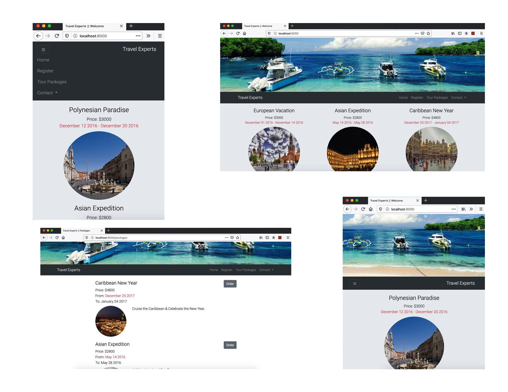

# Travel Experts Website

### Description

This project is developed to demonstarate DB to UI design for a travel agency website. The server side code developed using Node JS. EJS view engine is used for creating dynamic pages with data retrieving from database. Bootstrap framework is used to make all pages responsive.

### Snapshot

### Frontend

- Bootstrap style is utlized for responsive design
- EJS view engin is used to design dynamic pages
- static files are fetched from static folder

### Backend:

- server.js: runs express and builds basis for fetching data from json files (which is our temp database)
- index.js: router handler and all router requests sent from index.js file. top packages and About us is the content of rhis page
- order.js: handeles all orders request by user to book a package, data validation is done on frontend
- packages.js: fetches all packages from database(json file) to front end
- register.js: handles user registration, data validation is done on frontend
- contactus: provides from to user to submit feedback. from data are handled in backend to submit to database
- contactlist: fetches agent and agency information from database and show them on frontend

### References

- Index page hero image: (https://www.evaair.com/en-th/index.html)
- Packages page images: (https://loveandroad.com/beautiful-squares-in-the-world/)
- Inspiered from Daniel Khan for LinkedIn Learning Course
